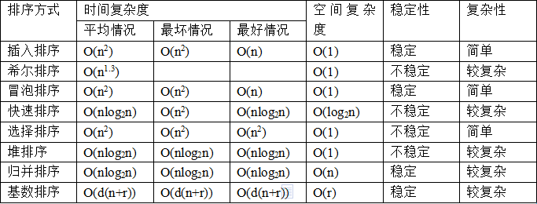
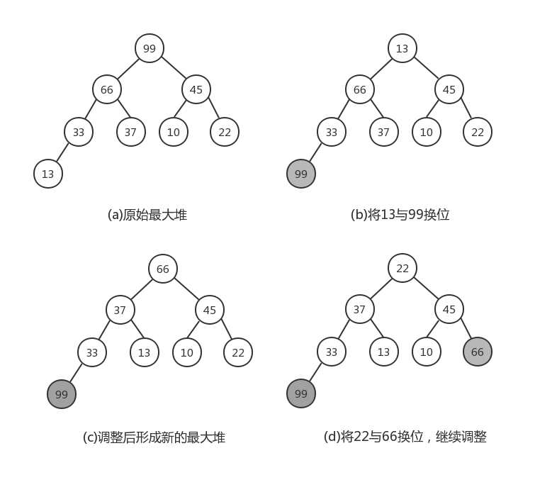
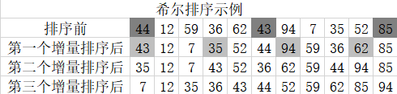
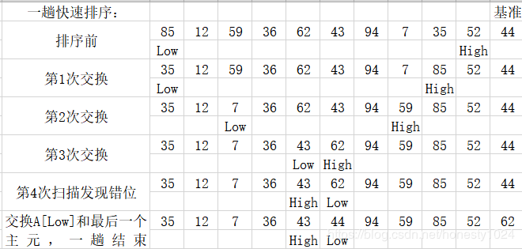
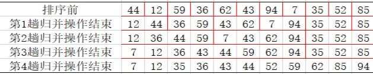

# 排序



### 选择排序

##### 	①简单选择排序

​	在未排序的序列中选出最小的元素和序列的首位元素交换，接下来在剩下的未排序序列中再选出最小元素与序列的第二位元素交换，依此类推，最后形成从小到大的已排序序列。

```
/*简单选择排序，时间复杂度：O（n2）*/
int i,j,min;
for(i=0;i<N-1;i++)
{    /*寻找最小元素*/
    min=i;
    for(j=i+1;j<N-1;j++)
    {
        if(a[j]>a[min])     
            min=j;    /*min记录最小元素*/
    }
    Swap(a[j],a[min]);    /*将第i个元素与最小元素交换*/
}
```


##### 	②堆排序

​	利用最大堆（或者最小堆）输出堆顶元素，即最大值（或者最小值），将剩余元素重新生成最大堆（或者最小堆），继续输出堆顶元素，重复此过程，直到全部元素都已输出，得到的输出元素序列即为有序序列。

​      首先将一个无序的序列生成一个最大堆，如（a）不需要输出堆顶元素，只需对换堆顶与堆最后一个元素的位置即可如（b）。此时最后一个元素99一定是递增序列的最后一个元素，且在对的位置。（c）是调整后形成的新的最大堆。要注意99已被排除在最大堆外，即在调整的时候，堆中元素个数-1.结束第一轮调整后，再次将当前堆中最后一个元素22与堆顶元素对换，如（d），再继续调整成新的最大堆······如此循环，直到堆中只剩一个元素，即可停止，得到一个从小到大的序列。



```
/*堆排序，时间复杂度O（nlogn）*/
void PercDown(ElementType a[],int p,int n)
{
/*将n个元素的数组中以a[p]为根的子堆调整为最大堆*/
	int Parent,Child; 
	ElementType x;
	x=a[p];/*取出根结点存放的值*/
	for(Parent=p;(Parent*2+1)<n;Parent=Child)
	{
		Child=Parent*2+1;
		if((Child!=n-1)&&(a[Child]<a[Child+1]))
			Child++;/*Child指向左右子结点的较大者*/
		if(x>=a[Child]) 
			break;/*找到了合适位置*/
		else /*下滤x*/
			a[Parent]=a[Child];
	}
	a[Parent]=x;
}
void HeapSort(ElementType a[],int n)
{/*堆排序*/
	int i;
	for(i=n/2-1;i>=0;i--)/*建立最大堆*/
		PercDown(a,i,n);
	for(i=n-1;i>0;i--)
	{/*删除最大堆顶*/
		Swap(a[0],a[i]);
		PercDown(a,0,i);
	}
}
```


------


### 插入排序

#####     ①简单插入排序

​	将待排序的一组序列分为已排好序的和未排序的两个部分；初始状态 时，已排序序列仅包含第一个元素，未排序序列中的元素为除去第一个元素以外的N-1 个元素；此后将未排序序列中的元素逐一插入到已排序的序列中。如此往复，经N-1 次插入后，未排序序列元素个数为0，则排序完成。

```
/*插入排序，时间复杂度：O（n2）*/
void InsertionSort(ElementType a[],int N)
{
	int P,i;
	ElementType tmp;
	for(P=1;P<N;P++)
	{
		tmp=a[P]/*取出未排序序列中的第一个元素*/
		for(i=P;i>0&&a[i-1]>tmp;i--)
			a[i]=a[i-1];/*依次与已排序序列中元素比较并右移*/
		a[i]=tmp;/*放进合适的位置*/
	}
}
```

##### 	②希尔排序

​	将待排序的一组元素按一定间隔分为若干个序列，分别进行插入排序。开 始时设置的“间隔”较大，在每轮排序中将间隔逐步减小，直到“间隔”为1，也就是 最后一步是进行简单插入排序。

​    待排序列：{44，12，59，36，62，43，94，7，35，52，85}

​    增量序列：{5，3，1}



```
void ShellSort(ElementType a[],int n)
{
/*希尔排序-用Sedgewick增量序列*/
	int Si,d,p,i;
	ElementType temp;
	int Sedgewick[]={929,505,209,109,41,19,5,1,0}/*这里只列出小部分增量*/
	for(Si=0;Sedgewick[Si]>=n;Si++);/*初始的增量Sedgewick[Si]不能超过待排序列长度*/
	for(d=Sedgewick[Si];d>0;d=Sedgewick[++Si])
	{ 
		for(p=d;p<n;p++)
		{/*插入排序*/
			temp=a[p];
			for(i=p;i>=d&&a[i-d]>temp;i-=d)
				a[i]=a[i-d];
			a[i]=temp;
		}
	} 
}
```


------


### 交换排序

##### 	①冒泡排序

​	它重复地走访过要排序的元素列，依次比较两个相邻的元素，如果他们的 顺序（如从大到小、首字母从A到Z）错误就把他们交换过来。走访元素的工作是重复 地进行直到没有相邻元素需要交换，也就是说该元素列已经排序完成。

```
/* 冒泡排序，时间复杂度：O（n2） */
/* 1. 从当前元素起，向后依次比较每一对相邻元素，若逆序则交换 */
/* 2. 对所有元素均重复以上步骤，直至最后一个元素 */
/* elemType arr[]: 排序目标数组; int len: 元素个数 */

void bubbleSort (elemType arr[], int len) 
{
    elemType temp;
    int i, j;
    for (i=0; i<len-1; i++)
	{ /* 外循环为排序趟数，len个数进行len-1趟 */
       	for (j=0; j<len-1-i; j++) 
		{ /* 内循环为每趟比较的次数，第i趟比较len-i次 */
            if (arr[j] > arr[j+1]) 
			{
 /* 相邻元素比较，若逆序则交换（升序为左大于右，逆序反之） */
                temp = arr[j];
                arr[j] = arr[j+1];
                arr[j+1] = temp;
			}
        }
	}
} 
```


#####     ②快速排序

​	将未排序元素根据一个作为基准的“主元”（Pivot）分为两个子序列，其中一个子序列的记录大于主元，而另一个子序列的记录小于主元，然后递归地堆这两个子序列用类似的方法进行排序。

快速排序算法一：



```
ElementType Median3(ElementType a[],int left int right)
{
	int center=(left+right)/2;
	if(a[left]>a[center])
		Swap(a[left],a[center]);
	if(a[left]>a[right])
		Swap(a[left],a[right]);
	if(a[center]>a[right])
		Swap(a[center],a[right]);
	/*此时a[left]<=a[center]<=a[right]*/
	Swap(a[center],a[right-1]);/*将基准Pivot藏到右边*/
	/*只需要考虑a[left+1]···a[right-2]*/
	return a[right-1];/*返回基准Pivot*/
	}

void Qsort(ElementType a[],int left int right)
{/*核心递归函数*/
	int Pivot,Cutoff,low,high;
	if(Cutoff<=right-left)
	{/*如果序列元素充分多，进入快排*/
		Pivot=Median3(a,left,right);/*选基准*/
		low=left;high=right; 
		while(1)
		{/*将序列中比基准小的移到基准左边，大的移到右边*/
			while(a[++low]<Pivot);
			while(a[--high]>Pivot);
			if(low<high)
				swap(a[low],a[high]);
			else 
				break;
		}
		Swap(a[low],a[right-1]);/*将基准换到正确的位置*/
		Qsort(a,left,low-1);/*递归解决左边*/
		Qsort(a,low+1,right);/*递归解决右边*/
	}
	else 
		InsertionSort(a+left,right-left+1);/*元素太少，用简单插入排序*/
}

void QuickSort(ElementType a[],int n)
{/*统一接口*/
	Qsort(a,0,n-1);
}
```

快速排序算法二：

通过一趟排序将要排序的数据分割成独立的两部分，其中一部分的所有数据都比另外一 部分的所有数据都要小，然后再按此方法对这两部分数据分别进行快速排序，整个排序 过程可以递归进行，以此达到整个数据变成有序序列。

```
void sort(int *a, int left, int right)
{
   	 	if(left >= right)    {return ;}
/*如果左边索引大于或者等于右边的索引就代表已经整理完成一个组了*/
    int i = left;
    int j = right;
    int key = a[left];
    while(i < j)                               /*控制在当组内寻找一遍*/
    {
        while(i < j && key <= a[j])
        /*而寻找结束的条件就是，1，找到一个小于或者大于key的数（大于或小于取决于你想升
        序还是降序）2，没有符合条件1的，并且i与j的大小没有反转*/ 
        {
            j--;/*向前寻找*/
        }
         
        a[i] = a[j];
        /*找到一个这样的数后就把它赋给前面的被拿走的i的值（如果第一次循环且key是
        a[left]，那么就是给key）*/
         
        while(i < j && key >= a[i])
        /*这是i在当组内向前寻找，同上，不过注意与key的大小关系停止循环和上面相反，
        因为排序思想是把数往两边扔，所以左右两边的数大小与key的关系相反*/
        {
            i++;
        }
         
        a[j] = a[i];
    }
     
    a[i] = key;/*当在当组内找完一遍以后就把中间数key回归*/
    sort(a, left, i - 1);/*最后用同样的方式对分出来的左边的小组进行同上的做法*/
    sort(a, i + 1, right);/*用同样的方式对分出来的右边的小组进行同上的做法*/
                       /*当然最后可能会出现很多分左右，直到每一组的i = j 为止*/
}
```


------


### 归并排序

​	将大小为N的序列看成N个长度为1的子序列，接下来将相邻子序列两两进行归并操作，形成N/2（+1）个长度为2（或者1）的有序子序列；然后再继续进行相邻子序列两两进行归并操作，如此一直循环，直到剩下一个长度为N的序列，则该序列为原序列完成排序后的结果。



```
/* L=左边起始位置，R=右边起始位置，RightEnd=右边终点位置*/
void Merge(ElementType a[],ElementType TempA[],int L,int R,int RightEnd)
{
/*将有序的a[L]~a[R-1]和a[R]~a[RightEnd]归并成一个有序序列*/
	int LeftEnd , NumElements,Temp;
	int i;
	LeftEnd =R-1;/*左边终点位置*/
	Temp=L;/*有序序列的起始位置*/
	NumElements=RightEnd-L+1;
	while(L<=LeftEnd &&R<=RightEnd)
	{
		if(a[L]<=a[R])
			TempA[Temp++]=a[L++];/*将左边元素复制到TempA*/
		else 
			TempA[Temp++]=a[R++];/*将右边元素复制到TempA*/
	}
	while(L<=LeftEnd )
		TempA[Temp++]=a[L++];/*直接复制左边剩下的*/
	while(R<=RightEnd )
		TempA[Temp++]=a[R++];/*直接复制右边剩下的*/
	for(i=0;i<NumElements;i++,RightEnd--)
		a[RightEnd]=TempA[RightEnd];/*将有序的TempA[]复制回a[]*/
}
 
void Msort(ElementType a[],ElementType TempA[],int L,int RightEnd)
{
/*核心递归排序函数*/
	int Center;
	if(L<RightEnd)
	{
		Center=(L+RightEnd)/2;
		Msort(a,TempA,L,Center);/*递归解决左边*/
		Msort(a,TempA,Center+1,RightEnd);/*递归解决右边*/
		Merge(a,TempA,L,Center+1,RightEnd);/*合并两端有序序列*/
	}
}
void Mergesort(ElementType a[],int n)
{
	/*归并排序*/
	ElementType *tempA;
	*tempA=(ElementType *)malloc(n*sizeof(ElementType ));
	if(tempA !=NULL)
	{
		Msort(a,tempA,0,n-1);
		free(tempA);
	}
	else 
		printf(“空间不足”);
}
```


------


### 基数排序

##### 	①桶排序

​	如果已知N个关键字的取值范围是0到M-1之间，而M比N小得多，则桶排序算法将为关键字的每个可能取值建立一个“桶”，即建立M个桶；在扫描N个关键字时，将每个关键字放入相应的桶中，然后按桶的顺序收集一遍就自然有序了。

#####     ②基数排序

​	基数排序（radix sort）属于“分配式排序”（distribution sort），又称“桶 子法”（bucket sort）或bin sort，顾名思义，它是透过键值的部份资讯，将要排序的元 素分配至某些“桶”中，藉以达到排序的作用，基数排序法是属于稳定性的排序，其时 间复杂度为O (nlog(r)m)，其中r为所采取的基数，而m为堆数，在某些时候，基数排 序法的效率高于其它的稳定性排序法。

```
/*基数排序*/
#include<math.h>
testBS()
{
    	int a[] = {2, 343, 342, 1, 123, 43, 4343, 433, 687, 654, 3};
    	int *a_p = a;
    	//计算数组长度
    	int size = sizeof(a) / sizeof(int);
    	//基数排序
    	bucketSort3(a_p, size);
    	//打印排序后结果
    	int i;
    	for(i = 0; i < size; i++)
        	printf("%d\n", a[i]);
    	int t;
    	scanf("%d", t);
}
//基数排序
Void bucketSort3(int *p, intn)
{
  	  	//获取数组中的最大数
    	Int maxNum = findMaxNum(p, n);
    	//获取最大数的位数，次数也是再分配的次数。
    	Int loopTimes = getLoopTimes(maxNum);
    	Int i;
    	//对每一位进行桶分配
    	for(i = 1; i <= loopTimes; i++)
    	{
        	sort2(p, n, i);
    	}
}
//获取数字的位数
Int getLoopTimes(int num)
{
   	 	Int count = 1;
    	Int temp = num / 10;
    	while(temp != 0)
    	{
        	count++;
        	temp = temp / 10;
    	}
    	Return count;
}
//查询数组中的最大数
Int findMaxNum(int *p, int n)
{
    	Int i;
    	Int max = 0;
    	for(i = 0; i < n; i++){
        	if(*(p + i) > max)
            	max = *(p + i);    }
    	Return max;
}
//将数字分配到各自的桶中，然后按照桶的顺序输出排序结果
voidsort2(int *p, int n, int loop)
{
    	//建立一组桶此处的20是预设的根据实际数情况修改
    	Int buckets[10][20] = {};
    	//求桶的index的除数
    	//如798个位桶index=(798/1)%10=8
    	//十位桶index=(798/10)%10=9
    	//百位桶index=(798/100)%10=7
    	//tempNum为上式中的1、10、100
    	Int tempNum = (int)pow(10, loop - 1);
    	Int i, j;
    	for(i = 0; i < n; i++){
        	Int row_index = (*(p + i) / tempNum) % 10;
        	for(j = 0; j < 20; j++){
            	if(buckets[row_index][j] == NULL){
                	buckets[row_index][j] = *(p + i);
                	Break;}
        	}}
    	//将桶中的数，倒回到原有数组中
    	Int k = 0;
    	for(i = 0; i < 10; i++){
        	for(j = 0; j < 20; j++){
            	if(buckets[i][j] != NULL){
                	*(p + k) = buckets[i][j];
                	buckets[i][j] = NULL;
                	k++;}
        	}}
}
```

