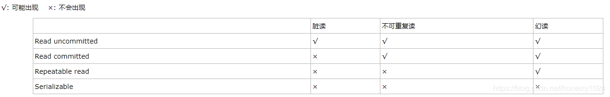

# 并发

### 事务

用户定义的一个数据库操作序列，这些操作要么全做，要么全不做，是一个不可分割的工作单位。

​        ①事务的ACID特性：原子，一致，隔离，持续。

​        ②Commit 表示提交，即提交事务的所有操作，具体说是将事务中所有对数据库的更新写回到磁盘上的物理数据库中去，事务正常结束。

​        ③Rollback 表示回滚，即在事务运行的过程中发生某种故障时，事务不能继续执行，系统将事务中对数据的所有已完成的操作（对数据库更新操作 ）全部取消，回滚到事务开始时的状态。

### 数据库的不一致性（脏读、不可重复读、丢失修改、幻读）

​        ①脏读：一个事务去读了未提交的数据操作结果，可能会回滚。

​        ②虚读：t1去读数据后，t2改了这个数据，t1再去读的时候读到不一样了。所以用不可重复读来避免

​        ③幻读：事务两次查询，两次查询中间另外事务对表修改了，所以第二次会发现出现了或者缺少了数据，不一样了

### 数据库的锁的种类，加锁的方式：

​    数据库中一般是悲观锁，认为数据随时会被修改。分为共享s锁（存在死锁，所有s锁的事务都想升级成x锁），排他x锁（写锁，禁止再加任何锁），和更新u锁（允许其他事务读，但是不允许再加u和x锁，当要被更新时升级为x锁）。

​        ①悲观锁按作用范围分为行锁和表锁

​        ②乐观锁：如果没有吞吐量瓶颈还是不用它，可能有风险

### 活锁和死锁：

​        ①活锁：活锁指的是任务或者执行者没有被阻塞，由于某些条件没有满足，导致一直重复尝试，失败，尝试，失败。 活锁和死锁的区别在于，处于活锁的实体是在不断的改变状态，所谓的“活”， 而处于死锁的实体表现为等待；活锁有可能自行解开，死锁则不能。

​        ②死锁：死锁是指两个或两个以上的进程在执行过程中，由于竞争资源或者由于彼此通信而造成的一种阻塞的现象，若无外力作用，它们都将无法推进下去。此时称系统处于死锁状态或系统产生了死锁，这些永远在互相等待的进程称为死锁进程。（两个事务永远不能结束，形成死锁）

​        ③死锁的四个特征：互斥，占有且等待，不可抢占，循环等待。

​        死锁产生的4个必要条件

​             1、互斥：某种资源一次只允许一个进程访问，即该资源一旦分配给某个进程， 其他进程就不能再访问，直到该进程访问结束。

​            2、占有且等待：一个进程本身占有资源（一种或多种），同时还有资源未得 到满足，正在等待其他进程释放该资源。

​            3、不可抢占：别人已经占有了某项资源，你不能因为自己也需要该资源，就 去把别人的资源抢过来。

​           4、循环等待：存在一个进程链，使得每个进程都占有下一个进程所需的至少 一种资源。

​        ④死锁的预防：

​           1.一次封锁法：要求每个事务必须一次将所有要用的数据全部加锁，否则不能继续执行。

​           2.顺序封锁法：预先对数据对象规定一个封锁顺序，所有事务都按这个顺序实施封锁。

​    两段锁协议：指所有事务必须分两个阶段对数据项进行加锁和解锁。1.在对任何数据进行读、写操作前，首先要申请并获得对该数据的封锁。2.在释放一个封锁后，事务不得再申请和获得任何其他封锁。