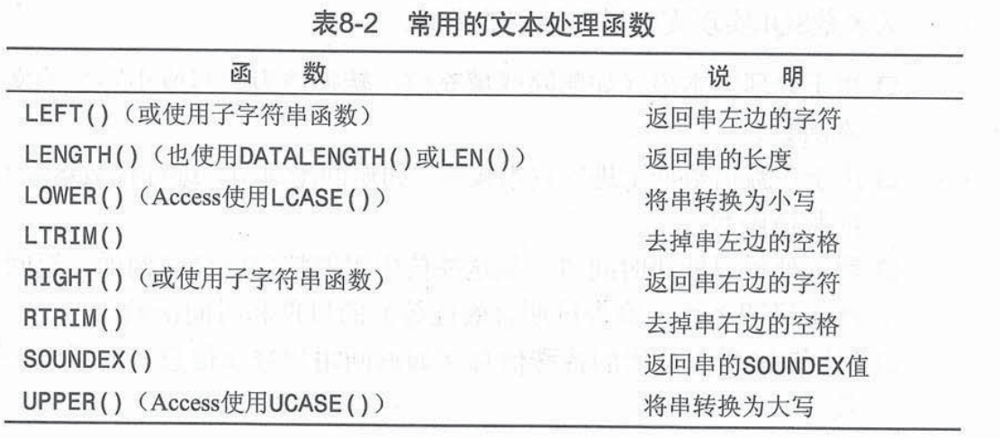
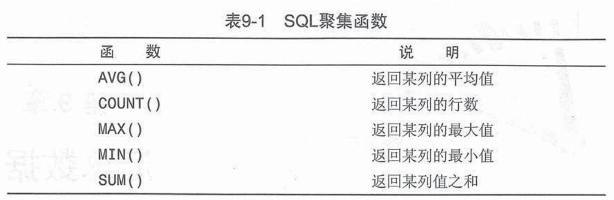
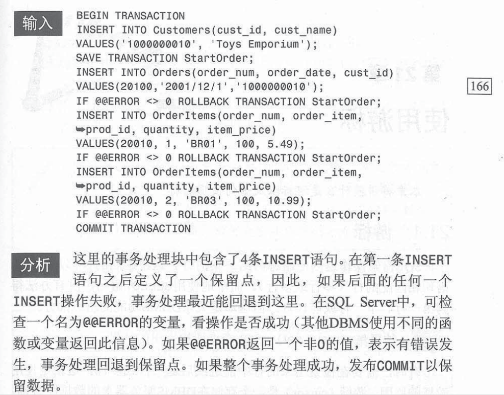

# SQL语句

数据定义，操纵，控制和事务控制语言DML：select，insert，update，delete，merge，call

### 创建和操纵表

​	创建表：

```
create table tableName(
	列名 类型 not null，// 非空
	列名 类型 not null  default 1，// 默认值1
);
```

​	更新表：

```
alter table tableName  add 列名 类型; // 加列
alter table tableName  drop column 列名; // 删列
```

​	删除表：

```
drop table tableName;
```


### 基本表

​		①Select *  from <tablename>   

​			列名 as 别名 

​			使用||或+操作符可拼接两个列（MySQL不支持这种做法）             

​        ②Insert into <tablename>(列名1，列名2) values()

​        ③update <tablename> set <列名> = <属性值> where <列名> = <属性值>

​        ④Delete from <tablename> where <列名> = <属性值>

​        ⑤group by <列名> [ having <列名> = <属性值> ]

​        ⑥order by 列名 ASC  , 列名 DESC

​		⑦where 子句：

​						<列名> like [ %通配符--未知字符 ] [ _通配符--单字符 ] [ []通配符指定一个字符集，它必须匹配通配																														符位置的一个字符 ]

​						<列名> in  某个范围

​						<列名> between ... and ...  

​						<列名> is null  

​						在处理or操作符前，优先处理and操作符 

### 函数

​	**文本处理函数**



​	**日期和时间处理函数**

​		①SQL Server和Sybase版本以及Access版本使用了DATEPART()函数

​			DATEPART()有两个参数，分别是返回的成分和从中返回成分的日期

​			where DATEPART('YYYY',date) = 2004

​		②Oracle： to_char()函数用来提取日期的成分 to_number()函数用来将提取出的成分转换为数值

​			where to_number(to_char(date,'yy'))=2004

​		③MySQL：year()函数从日期中提取年份

​			where year(date)=2004

​	**数值处理函数**


### 索引

​	索引用来排序数据以加快搜索和排序操作的速度。

​	索引改善检索操作的性能，但降低数据插入、修改和删除的性能。

​	索引数据可能要占用大量的存储空间。

​       ①create [unique] [cluster] index <索引名> on <表名>（<列名>）

​       ②alter index <旧索引名> rename to <新索引名>

​       ③delete index <索引名>

### 数据查询

​        ①聚集函数：count、sum、avg、max、min



​	对所有的行执行计算，指定ALL参数或者不给参数（ALL是默认参数）

​	只包含不同的值，指定DISTINCT参数    DISTINCT必须使用列名

​        ②连接查询：等值连接=，非等值连接，

​           ⅰ.内连接：一个学校表 inner join一个申请表，那么显示所有有人申请的学校；on 后面表示条件，where进一步过滤连接后的条目select * from  school inner join offer on (_=_);

​           ⅱ.外连接：左连接会把所有学校列出来，补全申请的信息，如果没有那么字段为null；select * from  school left  outer join offer on (_=_);

​         ⅲ.右连接会把所有申请列出来，补全学校的信息，如果没有那么字段为null；select * from  school right outer join offer on (_=_);

​         ⅳ.全连接:会把申请人的信息也补全，如果学校没有出现在表1，表1字段置为null；

​          ⅴ.交叉连接：笛卡尔积，a×b行，效率很低

​          ⅵ.自然连接： SELECT * FROM ORDERS O NATURAL LEFT OUTER JOIN CUSTOMERS C; 无需指定连接列，检查同名列。

​       ③嵌套查询：ANY、ALL、EXISTS

​        ④集合查询：并操作union、交操作intersect、差操作except

### 数据库安全性控制

​        ①创建角色：create role <角色名>

​        ②授权：grant<权限>on <对象类型><对象名> to <用户>

​        ③收回：revoke<权限>on <对象类型><对象名>from <用户>

### 事务

​	事务处理可以用来维护数据库的完整性，它保证成批的SQL操作要么完全执行，要么完全不执行。

​	事务(transaction)指一组SQL语句

​	回滚(rollback)指撤销指定SQL语句的过程

​	提交(commit)指将未存储的SQL语句结果写入数据库表

​	保留点指事务处理中设置的临时占位符，你可以对它发布回滚（与回滚整个事务处理不同）

