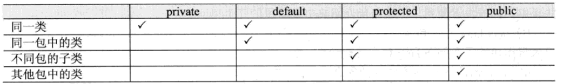

# 类（class）

初始化顺序：

​	继承的初始化顺序：先初始化父类，再初始化子类；

​	类中初始化顺序：

​	（1）类属性（静态变量）定义时的初始化

​	（2）static块中的初始化代码（当类被加载时，静态代码块被执行，且只执行一次。）

​	（3）对象属性（非静态变量）定义时的初始化

​	（4）构造方法（函数）中的初始化代码

this表示当前对象，this()调用父类中的无参构造方法

## 包及访问权限

在Java中有四种访问控制权限，分别为private、default、protected、public

## object类

1.toString()方法是返回对象的hashcode值（对象地址字符串）

2.equals()方法，比较的是对象的引用是否指向同一块内存地址（相同哈希值）。【在Object类中==与equals()方法是等效的】

详情见<https://www.cnblogs.com/Eason-S/p/5524837.html>  &&  <https://blog.csdn.net/qq_27471405/article/details/81010094>

3.hashCode()方法返回散列码

## 内部类

外部类声明的属性可以被内部类所访问；外部类需实例化内部类才能访问内部类的属性或方法

用static声明的内部类则变成外部类，其不能访问非static的外部类属性

在类外部引用内部类：外部类.内部类 name = 外部类.new 内部类（）；

在方法中定义内部类：

1.在方法中定义的内部类可以访问外部类的属性

2.在方法中定义内部类只能访问方法中的final类型的局部变量，因为用final定义的局部变量相当于常量，他的生命周期超出方法运行的生命周期

##### 匿名内部类

new 类型(){//声明部分};

##### 匿名对象

new 类型();

## static关键字

①静态成员（类变量）属于整个类，当系统第一次使用该类时，就会为其分配内存空间直到该类被卸载才会进行资源回收！

②静态方法（类方法）：

静态方法中可以直接调用静态成员，但不能直接调用非静态成员，需通过创建类的对象，再通过对象访问非静态变量。

静态方法中不能直接调用非静态方法，需通过对象来访问非静态方法。

普通成员方法中可以直接访问同类的非静态方法和静态方法。

③静态初始块：

静态初始块只在类加载时执行，且只会执行一次，同时静态初始块只能给静态变量赋值，不能初始化普通成员变量。

程序运行时，最先被运行的是静态初始块，再普通初始块，最后才是构造方法。

④静态内部类：

1、 静态内部类不能直接访问外部类的非静态成员，但可以通过 **new 外部类().成员** 的方式访问 

2、 如果外部类的静态成员与内部类的成员名称相同，可通过“类名.静态成员”访问外部类的静态成员；如果外部类的静态成员与内部类的成员名称不相同，则可通过“成员名”直接调用外部类的静态成员

3、 创建静态内部类的对象时，不需要外部类的对象，可以直接创建 **内部类 对象名= new 内部类();**

## final关键字

final关键字做标识有“最终的”含义。

final修饰类，则该类无法被继承。

final修饰方法，则该方法无法被覆盖（重写）。

final修饰属性，则该类的属性不会进行隐式地初始化（类的初始化属性必须有值）或者在构造方法中赋值（但二者只能选其一）

final修饰变量，则该变量只能赋值一次，即为常量。

## instanceof关键字

可以用instanceof判断一个类是否实现某个接口，也可以判断一个实例对象是否属于某个类型或者某个类型的子类

对象 instanceof 类（或接口）--->  return Boolean值