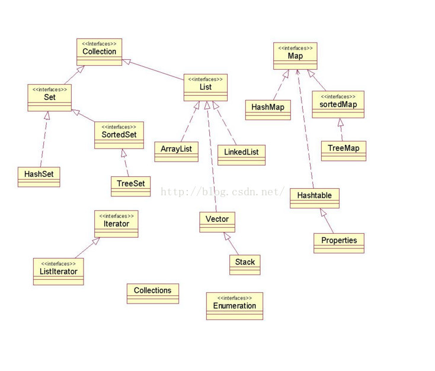
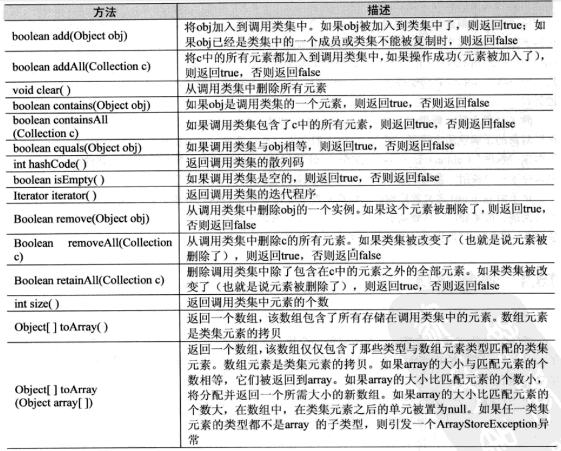
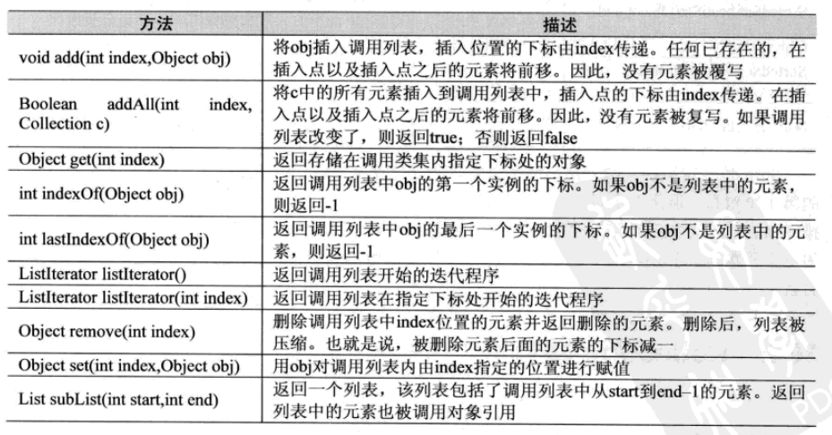
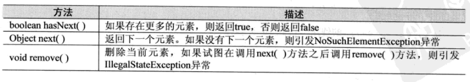
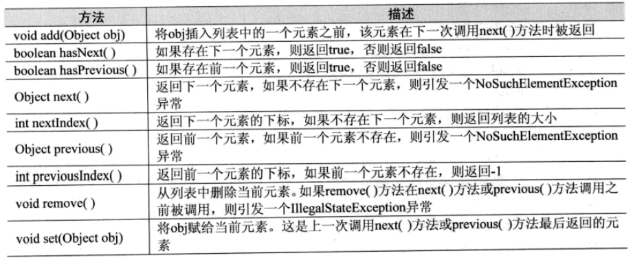
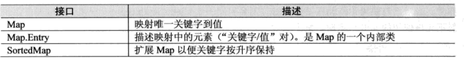
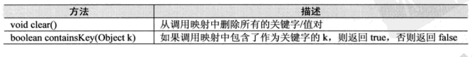
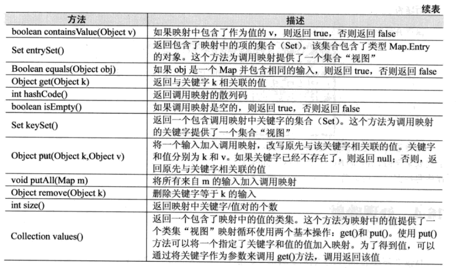

# 集合类（Collection）



## Collection接口

Collection接口是构造类集框架的基础。它声明所有类集将拥有的核心方法。




(1)contains()方法是根据Object类的equals()方法和hashCode()方法来查询是否存在该对象

​	查询Collection(或List、Set)中是否存在某对象，需要重写equals()和hashCode()两种方法

(2)如果要判断非基本类型的对象是否存在于集合中，都需要重写equals()和hashCode()两种方法。因为两个非基本类型的对象，即便内容相同，但是它们的hashCode和内存地址不同。


### List接口

List是有序的

List接口扩展了Collection并声明存储一系列元素的类集的特性，使用一个基于零的下标，元素可以通过它们在列表中的位置被插入和访问。



(1)indexOf()方法也是根据Object类的equals()方法和hashCode()方法来查询。一般先调用contains()方法，后调用该方法。


### Set接口

Set是无序的

#### SortedSet接口

SortedSet接口扩展了Set并说明了按升序排列集合的特性。


------


## Collection实现类


### ArrayList类

ArrayList类扩展了AbstractList并执行List接口。

ArrayList支持可随需要而增长的动态数组。

```
ArrayList有如下的构造方法：

ArrayList()		//建立一个空数组列表
ArrayList(Collection c)		//建立一个数组列表，该数组列表由类c中的元素初始化
ArrayList(int capacity)		//建立一个有指定初始容量的数组列表
```


### LinkedList类

LinkedList类扩展了AbstractList并执行List接口。

LinkedList类提供了一个链接列表的数据结构。

```
LinkedList的构造方法:

LinkedList()	//建立一个空链接列表
LinkedList(Collection c)	//建立一个链接列表，该链接列表由类c中的元素初始化
```

LinkedList还定义了一些用于操作和访问列表的方法

```
void addFirst(Object obj)	//在列表的头部添加元素
void addLast(Object obj)	//在列表的尾部添加元素
Object getFirst()	//获得第一个元素
Object getLast()	//获得最后一个元素
Object removeFirst()	//删除第一个元素
Object removeLast()		//删除最后一个元素
```


### HashSet类

HashSet扩展AbstractSet并实现Set接口。

它创建一个类集，该类集使用散列表进行存储，而散列表则通过使用称之为散列法的机制来存储信息。

```
HashSet的构造方法：

HashSet()		//建立一个默认的散列集合
HashSet(Collection c)		//建立一个用类c中的元素初始化散列集合
HashSet(int capacity)		//建立一个有指定初始容量的散列集合。
HashSet(int capacity,float fillRatio)		//建立一个有指定初始容量和填充比的散列集合

填充比：它决定在散列集合向上调整大小之前，有多少能被充满。
	具体说，就是当 元素个数 > 散列集合容量*填充比 时，散列集合被扩大。
	没有获得填充比，默认使用0.75。
```


### TreeSet类

TreeSet为了使用树来进行存储的Set接口提供了一个工具，对象按升序存储。

在存储了大量的需要进行快速检索的排序信息的情况下，TreeSet是一个很好的选择。

```
TreeSet的构造方法：

TreeSet()		//建立一个空的树集合，该树集合将根据元素的自然顺序按升序排序
TreeSet(Collection c)		//建立一个用类c中的元素初始化的树集合
TreeSet(Comparator comp)		//建立一个空的树集合，它按照由comp指定的比较方法进行排序
TreeSet(SortedSet ss)		//建立一个包含了ss元素的树集合
```


------


## 迭代器

通过迭代器访问类集的方法：使用iterator()

iterator()是一个实现Iterator，或者实现ListIterator接口的对象

Iterator：可以完成通过循环输出类集内容，从而获得和删除元素



ListIterator：扩展了Iterator，允许双向遍历列表，并且可以修改单元

只适用于实现了List接口的类集




```
使用迭代方法通过循环输出类集的内容，具体操作步骤如下：
Iterator it = 类集对象.iterator();
while(it.hasNext()){
	it.next();
}
```


------


# 映射

映射（map）是一个存储关键字和值的关联。

关键字和值都是对象，关键字必须唯一，但值是可以被复制的。

有的映射可以接收null关键字和null值，有的则不能。




## 映射接口

### Map接口

Map接口映射唯一关键字到值。





Map接口的entrySet()方法，调用该方法可返回一个包含映射输入的集合（Set），这些集合元素的每一个都是一个Map.Entry对象。

```
HashMap hm =new HaspMap();
// 填充数据
 	...	
//返回包含映射中项的集合
Set set = hm.entrySet();
Iterator it set.iterator();
while(it.hasNext()){
	Map.Entry me =(Map.Entry) it.next();
}
```


### SortedMap接口

SortedMap接口扩展了Map，它确保了各项按升序排序。


### Map.Entry接口

Map.Entry接口使得可以操作映射的输入。


------


## 映射类


### HashMap类

HashMap类使用散列表实现Map接口并扩展AbstractMap。

一个HashMap只允许有一个Key值为null的映射。

```
HashMap的构造方法：

HashMap()	//构造一个默认的散列映射
HashMap(Map m)	//用m的元素初始化散列映射
HashMap(int capacity)	//初始化散列映射容量
HashMap(int capacity,float fillRatio)	//初始化散列映射的容量和填充比

填充比：它决定在散列映射向上调整大小之前，有多少能被充满。
	具体说，就是当 元素个数 > 散列映射容量*填充比 时，散列映射被扩大。
	没有获得填充比，默认使用0.75。
```

注：散列映射并不保证它的元素的顺序。因此，元素加入散列映射的顺序不一定是它们被迭代方法读出的顺序


### TreeMap类

TreeMap类通过使用树实现Map接口，实现SortedMap并且扩展AbstractMap。

TreeMap提供了按排序顺序存储关键字/值对的有效手段，同时允许快速检索。

树映射保证它的元素按照关键字升序排序。

```
TreeMap的构造方法：

TreeMap()	//构造一个空树的映射，该映射使用其关键字的自然顺序来排序
TreeMap(Comparator comp)	//构造一个空的基于树的映射，该映射通过使用Comparator来排序
TreeMap(Map m)	//用从m的输入初始化树映射，该映射使用其关键字的自然顺序来排序
TreeMap(SortedMap sm)	//用从sm的输入来初始化一个树映射，该映射将按与sm相同的顺序来排序
```


------


## 比较方法

Comparable接口：默认比较规则----可比较的

实现该接口表示：该类的实例可以比较大小，可以进行自然排序

其实现类需要实现compareTo()方法：返回正数表示大，0表示相等，负数表示小。

Comparator接口：临时比较规则----比较工具接口

其实现类需要实现compare()方法。

```
Comparator接口定义了两个方法：
int compare(Object obj1,Object obj2)   //两个对象相等，返回0；当obj1>obj2，返回正数；否则负数
boolean equals(Object obj) //比较obj和调用对象，它们都是Comparator对象，且使用相同排序，则返回true；否则，返回false
```

