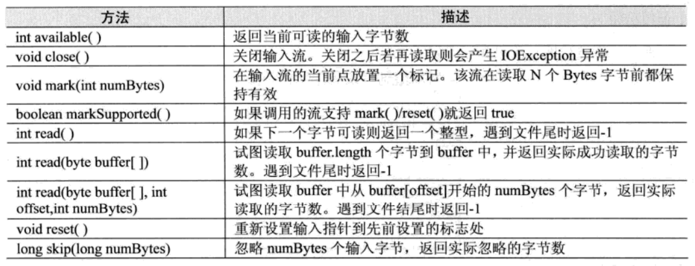
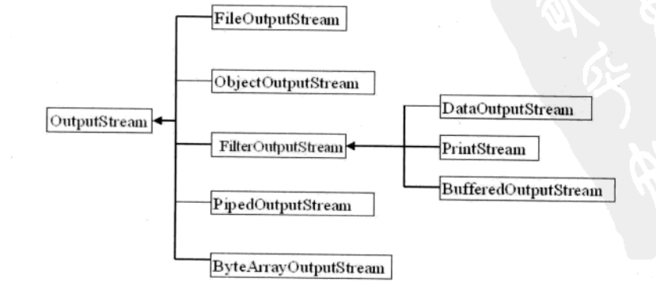
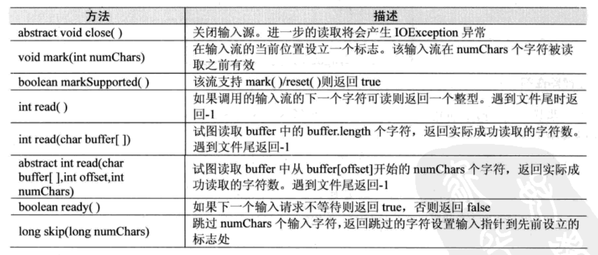
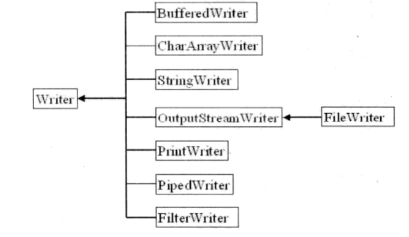
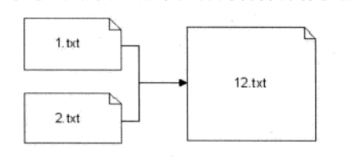

# I/O流

### 字符编码

Unicode编码的字符都是占用2个字节

GBK编码中文占用2个字节，英文占用1个字节。

UTF-8编码中文占用3个字节，英文占用1个字节。

UTF-16be编码中文占用2个字节，英文占用2个字节。

文本文件就是字节序列；可以是任意编码的字节序列；但若在中文机器上直接创建文本文件，那么该文本文件只认识ansi编码。

**Java文件模式**

在硬盘上的文件是byte byte byte 存储的，是数据的集合

## File类

File类是IO包中唯一代表磁盘文件本身的对象。

java.io.File类用于表示文件（目录）

File类只用于表示文件（目录）的信息（名称、大小等），不能用于文件内容的访问。

```
File(String directoryPath) 	//用此构造方法生成File对象
```

**File类的常用方法：**

exists()方法：判断文件（目录）是否存在

isDirectory()方法：判断是否为目录

list()方法：用于列出当前目录下的子目录和文件

listFiles()方法：返回File类型，列出当前目录下的子目录和文件

## RandomAccessFile类

RandomAccessFile类可以说是Java语言中功能最为丰富的文件访问类，它提供了众多的文件访问方法。

RandomAccessFile类支持随机访问文件，可以访问文件的任意位置。

（1）打开文件

RandomAccessFile有两种模式：“rw”、“r”

RandomAccessFile raf =new RandomAccessFile(file,"rw");

RandomAccessFile对象类有一个位置指示器--文件指针，指向当前读写处的位置，打开文件时指针在开头pointer = 0；

（2）写方法

```
raf.write(int)--->只写一个字节（后8位），同时指针指向下一个位置，准备再次写入

写入一个Int值，需要写入四次

raf.write(int>>>24)；raf.write(int>>>16)；raf.write(int>>>8)；raf.write(int)

或者raf.writeInt(int)；

String s ="是"；byte[] gbk =s.getBytes("gbk"); raf.write(gbk);
```

（3）读方法

```
int b = raf.read()--->读一个字节

raf.seek(0)//读文件，将指针移到头部

byte[] buf =new byte[(int)raf.length()]; 

raf.read(buf);//一次性读取，把文件中的内容都读到字节数组中
```

（4）文件读写完成以后一定要关闭

## 流类

Java的流式输入/输出建立在4个抽象类的基础上：InputStream、OutputStream、Reader、Writer。它们用来创建具体流式子类。

InputStream和OutputStream被设计成字节流类，一般用于处理字符和字符串。

Reader和Writer被设计成字符流，一般用于处理字节或者二进制对象。

一般在操作文件流时，不管是字节流还是字符流，都可以按照以下方式进行。

（1）使用File类找到一个文件

（2）通过File类的对象去实例化字节流或者字符流的子类

（3）进行字节（字符）的读、写操作

（4）关闭文件流


注：EOF==end -1

### 字节流

字节流类为处理字节式输入/输出提供了丰富的环境。一个字节流可以和其他任何类型的对象并用，包括二进制数据，但它们不能直接操作Unicode字符。

InputStream负责读操作，OutputStream负责写操作

#### InputStream（输入字节流）

InputStream是一个定义了Java流式字节输入模式的抽象类，该类所有方法在出错时都会引发IOException异常



InputStream类的层次结构：


#### OutputStream（输出字节流）

OutputStream是定义了流式字节输入模式的抽象类，该类所有方法返回一个void值并且在出错时都会引发IOException异常。


OutputStream类的层次结构：



#### FileInputStream（文件输入流）

FileInputStream具体实现了在文件上读取数据

FileInputStream类创建了一个能从文件读取字节的InputStream类

```
FileInputStream的常用构造方法：
FileInputStream(String filepath)	// filepath是文件的绝对路径
FileInputStream(File fileObj)	// fileObj是描述该文件的File对象
```

#### FileOutputStream（文件输出流）

FileOutputStream实现了向文件中写出byte数据的方法

FileOutputStream创建了一个可以向文件写入字节的OutputStream类。

```
FileOutputStream的常用构造方法：
FileOutputStream(String filepath)	// filepath是文件的绝对路径
FileOutputStream(File fileObj)	// fileObj是描述该文件的File对象
FileOutputStream(String filePath,boolean append) // 如果append为true，文件则以设置搜索路径模式打开。
FileOutputStream的创建不依赖于文件是否存在。
在创建对象时，FileOutputStream会在打开输出文件之前就创建它。
在这种情况下如果试图打开一个只读文件，则会引发IOException异常。
```


------


### 字符流

字符流（Reader Writer)---->操作的是文本文档文件

字符的处理：一次处理一个字符

字符的底层仍是基本的字节序列

#### Reader（字符输入流）

Reader是定义Java的流式字符输入模式的抽象类，该类所有方法在出错时都会引发IOException异常



Reader类的层次结构：


#### Writer（字符输出流）

Writer是定义流式字符输入模式的抽象类，该类所有方法返回一个void值并且在出错时都会引发IOException异常。


Writer类的层次结构：



**FileReader/FileWriter 不提供字符的编码参数**

#### FileReader

FileReader类创建了一个可以读取文件内容的Reader类。

```
FileReader的构造方法：
FileReader(String filepath)	// filepath是文件的绝对路径
FileReader(File fileObj)	// fileObj是描述该文件的File对象
```


#### FileWriter

FileWriter创建了一个可以写文件的Writer类。

```
FileWriter的构造方法：
FileWriter(String filepath)	// filepath是文件的绝对路径
FileWriter(File fileObj)	// fileObj是描述该文件的File对象
FileWriter(String filePath,boolean append) // 如果append为true，输出是附加到文件尾的。
FileWriter的创建不依赖于文件是否存在。
在创建对象时，FileWriter将在创建对象时打开它来作为输出。
如果试图打开一个只读文件，则会引发IOException异常。
```

#### InputStreamReader

InputStreamReader完成byte流解析为char流，按编码解析

#### OutputStreamWriter

OutputStreamWriter提供char流到byte流，按照编码处理

​	

字符流的过滤器：

​	BufferedReader ---->readLine一次读一行，并不能识别换行

​	BufferedWriter/PrintWriter ---->写一行


------


### 管道流

管道流主要用于连接两个线程间的通信。

管道流也分为字节流（PipedInputStream、PipedOutputStream）与字符流（PipedReader、PipedWriter）

一个PipedInputStream对象必须和一个PipedOutputStream对象进行连接而产生一个通信管道，PipedOutputStream可以向管道写入数据，PipedInputStream可以从管道中读取PipedOutputStream写入的数据。如图所示，这两个类主要用来完成线程之间的通信，一个线程的PipedInputStream对象能够从另一个线程的PipedOutputStream对象中读取数据。


------


#### ByteArrayInputStream与ByteArrayOutputStream

ByteArrayInputStream是输入流的一种实现。

```
ByteArrayInputStream的构造方法：
每个构造方法都需要一个字节数组来作为其数据源
ByteArrayInputStream(byte[] buf)
ByteArrayInputStream(byte[] buf,int offse,int length)
ByteArrayInputStream()
ByteArrayInputStream(int )
```


------


#### System.in与System.out

为了支持标准输入输出设备，Java定义了两个特殊的流类：System.in与System.out。

System.in对应键盘，属于InputStream类型，程序使用System.in可以读取从键盘上输入的数据

System.out对应显示器，属于PrintStream类型，PrintStream是OutputStream的一个子类，程序中使用System.out可以将数据输出到显示器上。


------


### 打印流

PrintStream类提供了一系列的print和println方法，可以实现将基本数据类型的格式转换成字符串输出。

System.out是PrintStream类的一个实例对象。

```
PrintStream的构造方法：
PrintStream(OutputSream out)
PrintStream(OutputSream out,boolean autoflush)
PrintStream(OutputSream out,boolean autoflush,String encoding)

autoflush控制在Java中遇到换行符（\n）时是否自动清空缓冲区，encoding是指编码方式。
```

IO包中提供了一个与PrintStream对应的PrintWriter类

```
PrintWriter的构造方法：
PrintWriter(OutputSream out)
PrintWriter(OutputSream out,boolean autoflush)
PrintWriter(Writer w)
PrintWriter(Writer w,boolean autoflush)

PrintWriter即便遇到换行符（\n）也不会自动清空缓冲区，只在设置了autoflush模式下使用println方法后猜会自动清空缓冲区。
```

PrintWriter相对PrintStream最有利的一个地方是println方法的行为，Windows下的文本换行是"\r\n"，而Linux下的文本换行是"\n"，PrintWriter的println方法能根据不同的操作系统而生成相应的换行符。


------


#### DataOutputStream与DataInputStream

DataOutputStream与DataInputStream提供了与平台无关的数据操作，通常会先通过DataOutputStream按照一定的格式输出，再通过DataInputStream按照一定格式读入。

DataOutputStream/DataInputStream：对“流”功能的扩展，可以更加方便地读取int、long、字符等类型数据


------


#### 合并流

采用SequenceInputStream类，可以实现两个文件的合并操作。



```
//构造两个被读入的文件
File intputFile1 = new File("c:\\1.txt");
File intputFile2 = new File("c:\\2.txt");
//构造一个输出文件
File outputFile = new File("c:\\12.txt");

FileInputStream in1= new FileInputStream(inputFile1);
FileInputStream in2= new FileInputStream(inputFile2);
//将两个输入流合为一个输入流
SequenceInputStream s= new SequenceInputStream(in1,in2);
out = new FileOutputStream(outputFlie);
int c;
while((c = s.read())!=-1){
	out.write(c);
}
in1.close();
in2.close();
s.close();
out.close();
```


------


#### 字节流与字符流的转换

InputStreamReader和OutputStreamWriter，这两个类是字节流和字符流之间相互转换的类，InputStreamReader用于将一个字节流中的字节解码成字符，OutputStreamWriter用于将写入的字符编码成字节后写入一个字节流。

```
InputStreamReader两个主要的构造方法：
// 用默认字符集创建一个InputStreamReader对象
InputStreamReader(InputStream in)
// 接收已指定字符集名的字符串，并用该字符集创建对象
InputStreamReader(InputStream in,String CharseName)

OutputStreamWriter两个主要的构造方法：
// 用默认字符集创建一个OutputStreamWriter对象
OutputStreamWriter(OutputStream out)
// 接收已指定字符集名的字符串，并用该字符集创建OutputStreamWriter对象
OutputStreamWriter(OutputStream out,String CharseName)
```

为了达到最高的效率，避免频繁地进行字符与字节间的相互转换，最好不要直接使用这两个类来进行读写，而应尽量使用BufferedWrite类包装OutputStreamWriter类，用BufferedReader包装InputStreamReader类。

```
BufferedWrite out = new BufferedWrite(new OutputStreamWriter(System.out));
BufferedReader in = new BufferedReader(new InputStreamReader(System.in));

String strLine=in,readLine();//读取字符串至in
```

#### BufferedOutputStream/BufferedInputStream

BufferedOutputStream/BufferedInputStream：为IO提供了带缓冲区的操作，一般打开文件进行写入或者读取操作时，都会加上缓冲。提高了IO的性能

从应用程序中把输入放入文件，相当于把一缸水倒入到另一缸中：

FileOutputStream-->write()方法相当于一滴一滴地把水转移过去

DataOutputStream-->writeXxx()方法会方便一些，相当于一瓢一瓢把水转移过去

BufferedOutputStream-->write方法更方便，相当于一瓢一瓢水先放入桶（缓冲区）中，再从桶中倒入到另一缸中


------


### 对象的序列化和反序列化

对象序列化是指将对象转换成二进制数据流的一种实现手段。通过将对象序列化，可以方便实现对象的传输及保存。

在Java中提供有ObjectInputStream与ObjectOutputStream这两个类用于序列化对象的操作。这两个类是用于存储和读取对象的输入输出流类。

ObjectInputStream类与ObjectOutputStream类，用于帮助开发者完成保存和读取对象成员变量取值的过程，但要求读写或存储的对象必须实现了Serializable接口，但Serializable接口中没有定义任何方法，仅仅被用作一种标记，以被编译器作特殊处理。


```
例子：
import java.io.*;
class Person implements Serializable
{
	private String name;
	private int age;
	public Person(String name,int age){
		this.name=name;
		this.age=age;
	}
}

public class SerializableDemo
{
	public static void main(String[] args){
		File f = new File("SerializablePerson");
        serialize(f);
        deserialize(f)
	}
	//以下方法为序列化对象方法
	public static void serialize(File f) throws Exception
	{
		OutputStream outputFile = new FileOutputStream(f);
		ObjectOutputStream cout = new ObjectOutputStream(outputFile);
		cout.writeObject(new Person("张三",25));
		cout.close();
	}
	//以下方法为反序列化对象方法
	public static void deserialize(File f) throws Exception
	{
		InputStream inputFile = new FileInputStream(f);
		ObjectInputStream cin = new ObjectInputStream(inputFile);
		Person p = (Person) cin.readObject();
		System.out.println(p);
	}
}
```


如果不希望类中某个属性被序列化，可以在声明属性之前加上transient关键字。