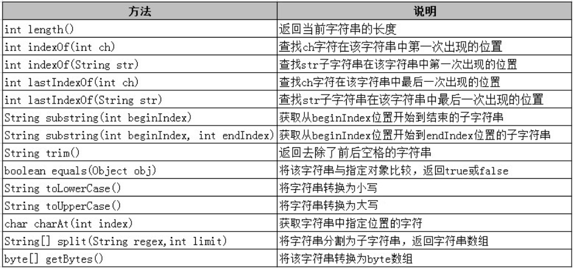
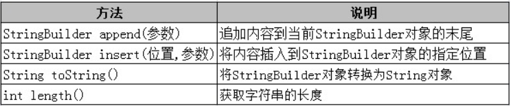
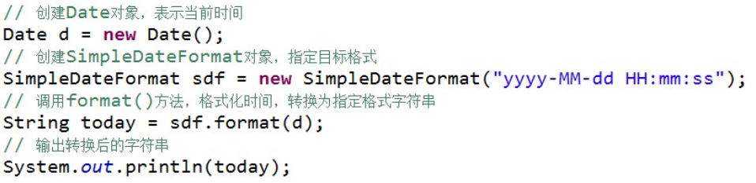
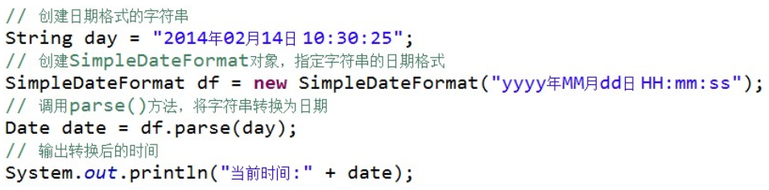
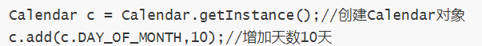
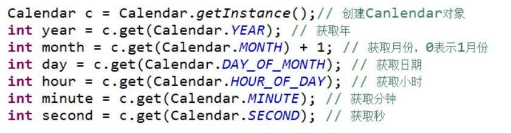
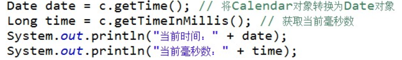
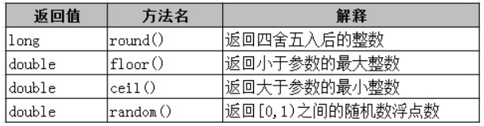

# 常用类

### String类与StringBuffer类

#### String类

字符串的不变性：String 对象创建后则不能被修改，是不可变的，所谓的修改其实是创建了新的对象，所指向的内存空间不同。

每次 new 一个字符串就是产生一个新的对象，即便两个字符串的内容相同，使用 ”==” 比较时也为 ”false” ,如果只需比较内容是否相同，应使用 ”equals()” 方法 

一旦一个字符串在内存中创建，则这个字符串将不可改变。如果需要一个可以改变的字符串，我们可以使用StringBuffer或者StringBuilder

（1）length()方法：返回字符串长度，字符串中字符的索引从0开始

（2）indexOf(c)方法：查找字符c，匹配返回位置索引；如果没有匹配结果，返回 -1

（3）substring(beginIndex , endIndex) 方法：字符串截取，包括 beginIndex 位置的字符，不包括 endIndex 位置的字符

注：==: 判断两个字符串在内存中首地址是否相同，即判断是否是同一个字符串对象；equals(): 比较存储在两个字符串对象中的内容是否一致

#### StringBuffer类

StringBuffer 是线程安全的，而 StringBuilder 则没有实现线程安全功能，所以性能略高。因此一般情况下，如果需要创建一个内容可变的字符串对象，应优先考虑使用 StringBuilder 类。

append(参数):追加内容至StringBuilder对象末尾。

insert(位置，参数)：将内容插入至StringBuilder对象的指定位置后。

### Date类与Calendar类、SimpleDateFormat类

#### Date类

使用 Date 类的**默认无参构造方法**创建出的对象就代表**当前时间**

#### SimpleDateFormat类

使用 SimpleDateFormat 来对日期时间进行格式化，如可以将日期转换为指定格式的文本，也可将文本转换为日期。

（1）使用 format() 方法将日期转换为指定格式的文本

（2）使用 parse() 方法将文本转换为日期

#### Calendar类

java.util.Calendar 类是一个抽象类，可以通过调用 getInstance() 静态方法获取一个 Calendar 对象，此对象已由当前日期时间初始化，即默认代表当前时间，如 Calendar c = Calendar.getInstance();

（1）Calendar.add方法用于实现在某一日期的基础上增加若干天（或年、月、小时、分、秒等日期字段）后的新日期

（2）Calendar,get方法用于取出日期对象中的年、月、日、小时、分、秒等日期字段的值

（3）Calendar,set方法用于修改日期对象中的年、月、日、小时、分、秒等日期字段的值

（4）Calendar 类提供了 getTime() 方法，用来获取 Date 对象，完成 Calendar 和 Date 的转换，还可通过 getTimeInMillis() 方法，获取此 Calendar 的时间值，以毫秒为单位。

### Math类与Random类

Math类包含了所有用于几何和三角的浮点运算方法

Random类是一个随机数产生器。一旦用一个初值创建Random对象，就可以得到一系列的随机数，但如果用相同的初值创建Random对象，得到的随机数序列是相同的。

