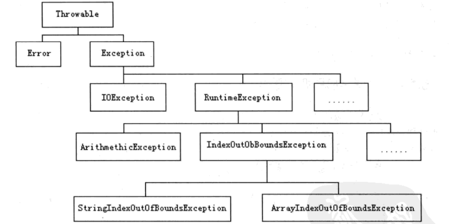

# 异常

异常分为两大类：java.lang.Error类、java.lang.Exception类。这两个类均继承自java.lang.Throwable类。




#### Error类

专门用来处理严重影响程序运行的错误。

系统错误（比如内存溢出），虚拟机错误，线程死锁

#### Exception

包含了一般性的异常，这些异常通常在捕捉到i之后便可做妥善的处理，以确保程序继续运行。

①RuntimeException：即便不编写异常处理代码，仍能编译成功，且它必须在程序运行时才有可能发生

#### ②IOException：一定要编写异常处理的程序代码才行；通常用来处理与输入/输出相关的操作

### 异常处理

```
try{
	要检查的程序语句;
	...
}catch(异常类 对象名称){
	异常发生时的处理语句;
}finally{
	一定会运行到的程序代码;
}
```

（1）多重catch语句中，异常类型必须子类在前，父类在后。

（2）finally子句一定会被执行，如果有try子句中有return语句，finally子句将会在return语句执行前执行，若没有，则最后执行。

#### 抛出异常

（1）在程序中抛出异常

​	throw：将产生的异常抛出（动作），同时也要在方法声明中声明

​	throw 异常类实例对象;

（2）指定方法抛出异常

​	throws：声明j将要抛出何种类型的异常（在方法体参数列表后声明），声明的异常在方法体中可以没有抛出。

·	方法名称（参数列表） throws 异常类1，异常类2，...

