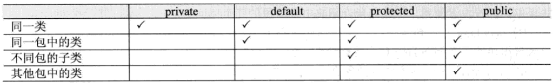

# 面向对象的三大特征

## 一、封装

​	将类的某些信息隐藏在类的内部，不允许外部程序直接访问，而是通过该类提供的方法来实现对隐藏信息的操作和访问。（一般通过private修饰符实现，用setter和getter方式设置或获取数据）

​	在Java中有四种访问控制权限，分别为private、default、protected、public

## 二、继承

1.继承是类与类的一种关系，是一种“is a ”的关系。 注：Java中继承是单继承。

2.继承的初始化顺序：

​	先初始化父类，再初始化子类；

​	类中初始化顺序：

​	（1）类属性（静态变量）：static 定义的属性

​	（2）静态方法块：static {} 修饰的方法块（当类被加载时，静态代码块被执行，且只执行一次。）+

​	（3）对象属性（非静态变量）：未带static定义的属性

​	（4）普通方法块：{}修饰的方法块

​	（5）构造方法（函数）中的初始化代码

3.子类的构造器会默认隐含父类的无参构造器，若父类没有无参的构造器，则需要主动调用父类构造器。

super关键字可以调用父类构造器（super();super(有参)；）、属性（super.属性;）、方法（super.方法名();）

this关键字表示当前对象

4.private修饰符限制子类访问

## 三、多态

1.对象的多种形态

①引用多态：父类的引用可以指向本类对象，父类的引用可以指向子类对象。

②方法多态：创建本类对象时，调用的方法为本类方法。创建子类对象时，调用的方法可以是子类重写的方法或者继承的方法。

2.重写：方法名称、参数个数、类型均一致

3.重载：方法名称一致，返回类型可以不一致，但参数列表不同

4.引用类型转换：

向上转型：将子类对象的引用视为父类对象的引用

向下转型：父类对象可以转换为子类对象，但需强制转换

5.instanceof 避免类型转换的安全性问题。

可以用instanceof判断一个类是否实现某个接口，也可以判断一个实例对象是否属于某个类型或者某个类型的子类

用法：对象 instanceof 类（或接口）--->  return Boolean值