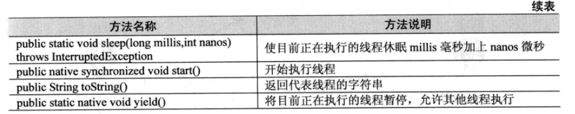

# 多线程

多线程是实现并发机制的一种有效手段。进程和线程一样，都是实现并发的基本单位。

**进程的特征**：

（1）一个进程就是一个执行中的程序，而每一个进程都有自己独立的一块内存空间，一组系统资源。在进程的概念中，每一个进程的内部数据和状态都是完全独立的。
（2）创建并执行一个进程的系统开销是比较大的。

（3）进程是程序的一次执行过程，是系统运行程序的基本单位。

**线程的特征**：

（1）在Java中，程序通过流控制来执行程序流。程序中单个顺序的流控制称为线程。

（2）多线程指的是在单个进程中可以同时运行多个b不同的线程，执行不同的任务。多线程意味着一个程序的多行语句可以看上去几乎同时运行。

二者都是一段完成某个特定功能的代码，是程序中单个顺序的流控制。

**不同点：**

同类的多个进程是共享一块内存空间和一组系统资源，而线程本身的数据通常只有微处理器的寄存器数据，以及一个供程序执行时使用的堆栈。所以系统在产生一个线程，或者在各个线程之间切换时，负担要比进程小得多，正因如此，线程也被称为轻负荷进程。

一个进程可以包含多个线程。

**进程和线程的主要差别体现在两个方面：**

（1）同样作为基本的执行单位，线程是划分得比进程更小的执行单位。

（2）每个进程都有一段专用的内存区域。与此相反，线程却共享内存单元（包括代码和数据），通过共享的内存单元来实现数据交换、实时通信与必要的操作。

## 进程

程序（任务）的执行过程--动态性；持有资源（共享内存、共享文件）和线程----载体。

进程中只有后台线程运行时，进程就会结束

## 线程

线程是系统最小的执行单元；同一个进程中可以有多个线程；线程共享进程的资源。

**激活线程**：

（1）线程扩展自Thread类，或者实现Runnable接口

（2）线程的处理必须编写在run()方法内

Thread类实现了Runnable接口，也就是是说Thread类也是Runnable接口的一个子类。

Runnable接口中只有一个run()方法。


**实现Runnable接口相对于继承Thread类来说，有几个显著优势：**

（1）适合多个相同程序代码的线程去处理同一资源的情况，把虚拟CPU（线程）同程序的代码、数据有效分离，较好地体现了面向对象的设计思想。

（2）可以避免由于Java的单继承特性带来的局限。开发中经常会遇到这样一种情况，即要将已经继承了某一个类的子类放入多线程中，由于一个类不能同时有两个父类，所以不能使用继承Thread类的方式，那么就只能采用实现Runnable接口的方式。

（3）增强了程序的健壮性，代码能够被多个线程共享，代码与数据是独立的。当多个线程的执行代码来着用一个类的实例时，即称它们共享相同代码。多个线程可以操作相同的数据，与它们的代码无关。当共享访问相同的对象时，即共享相同数据。当线程被构造时，需要的代码和数据通过一个对象作为构造方法实参传递进去，这个对象就是一个实现了Runnable接口的类的实例。


------


### 线程的状态

任何一个线程一般都具有5个状态，即创建、就绪、运行、阻塞、终止。


在给定时间点上，一个线程只能处于一种状态。

（1）New：至今尚未启动的线程处于这种状态

（2）Runnable：正在Java虚拟机中执行的线程处于这种状态

（3）Blocked：受阻塞并等待某个监视器锁的线程处于这种状态

（4）Waiting：无限期地等待另一个线程来执行某一个特定操作的线程处于这种状态

（5）Time_waiting：等待另一个线程来执行取决于指定等待时间的操作的线程处于这种状态

（6）Terminated：已退出的线程处于这种状态


------


#### 线程操作的一些方法




注：stop()方法不是一个正确的停止线程的方法，不应该出现在代码中，因为stop()方法不知道什么时候停止，也不知道做了什么，没做什么。

注：interrupt()方法同样也不是一个正确的退出线程的方法，即便调用了该方法，该方法会抛出中断异常，但线程还是会继续运行。


------


### 多线程的同步

程序中不能有多个进程同时在某一块代码之间执行，这就是线程同步。

```
synchronized（intrinsic lock）实现线程的互斥
只允许一个线程进入有synchronized修饰的方法
同步代码块定义语法：
synchronized(对象){
	需要同步的代码;
}

同步方法：
访问控制符 synchronized 返回值类型 方法名称(参数){}
```


------


### 线程间通信

Java是通过Object类的wait()、notify()、notifyAll()这几个方法来实现线程间通信的。

wait()：告诉当前线程放弃监视器并进入睡眠状态，直到其他线程进入同一监视器并调用notify()为止。

notify()：唤醒同一对象监视器中调用wait()的第一个线程。这类似排队买票，一个人买完之后，才能让后面的人买。

notifyAll()：醒同一对象监视器中调用wait()的所有线程，具有最高优先级的线程首先被唤醒并执行。


wait()、notify()、notifyAll()这三个方法只能在synchronized方法中调用，即无论线程调用一个对象的wait还是notify方法，该线程必须先得到该对象的锁标记。这样notify就只能唤醒同一对象监视器中调用wait的线程。而使用多个对象监视器，就可以分别有多个wait、notify的情况，同组理的wait只能被同组的notify唤醒。


------


#### 线程生命周期的控制


控制线程生命周期的方法有很多种，如suspend方法、resume方法、stop方法。但对这三个方法都不推荐使用，其中不推荐使用suspend方法和resume方法的原因如下。

（1）会导致死锁的发生。

（2）它允许一个线程（甲）通过直接控制另外一个线程（乙）的代码来直接控制那个线程（乙）。

虽然stop能避免死锁的发生，但也有其不足之处：如果一个线程正在操作共享数据段，操作过程没有完成就被“stop”了的话，将会导致数据的不完整性。

通过控制run方法种的循环条件的方式来结束一个线程的方法是值得推荐使用的方法，也是实际中用的最多的方法。


------


注：建议了解Java Memory Mode：JMM描述了Java线程如何通过内存进行交互。了解happens-before原则。

注:建议学习Locks &Condition。

注：线程安全性：原子性与可见性。Java.util.concurrent.atomic包；synchroniced&volatile;deadlock

注：多线程编程常用交互模型：Producer-Consumer模型、 Reader-Writer模型、 Future 模型、Worker Thread模型

注：Java并发编程工具：Java.util.concurrent包、线程池ExecutorService、Callable&Future、BlockingQueue。

注：Java concurrency in practice 书（并发圣经）core Java第九版